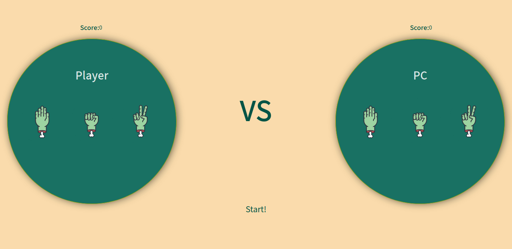

# Rock-Paper-Scissors
This is the famous game we know and we play it when we are children.
Game Rules:
A player who decides to play rock will beat another player who has chosen scissors ("rock crushes scissors" or sometimes "blunts scissors"), but will lose to one who has played paper ("paper covers rock"); a play of paper will lose to a play of scissors ("scissors cuts paper").
The game is 5 rounds who wins the 5 will win.

## Table of contents 

* [General info](#general-info)
* [Screenshots](#screenshots)
* [Technologies](#technologies)
* [Setup](#setup)
* [Status](status)
* [Inspiration](#inspiration)

## General info
I made this game because it was fun to make a project like this and it improves the logical thinking to me.

## Screenshots 

## Technologies

* HTML
* CSS
* javaScript

## Setup

If you wanna to check the game go to this live preview --> https://htmlpreview.github.io/?https://github.com/sheehaab/Rock-Paper-Scissors/blob/master/UI%20Rock%20Paper%20Scissors/index.html

## Status

Project is fininshed

## Inspiration

Project is inspired by @TheOdinProject

